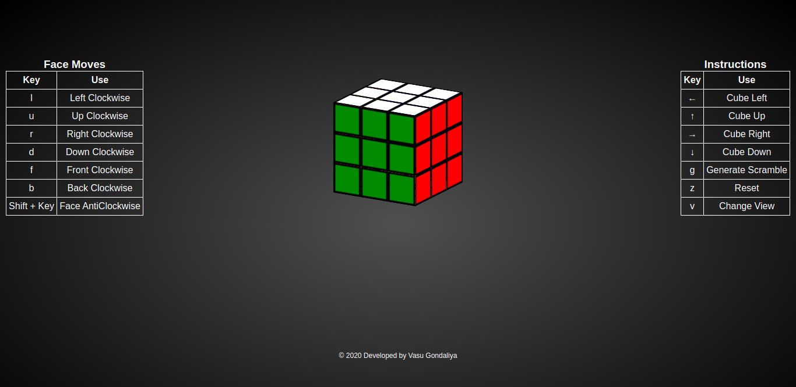
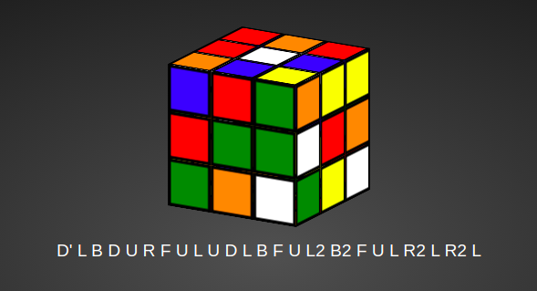
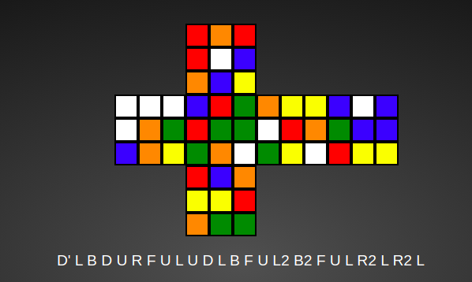

[](https://jayhemnani9910.github.io/rubiks-cube/)
[](https://github.com/jayhemnani9910/rubiks-cube/actions/workflows/ci.yml)
[](./LICENSE)

# Rubik's Cube Visualizer + Timer
A keyboard-first Rubik's Cube visualizer with scrambles, a configurable timer, and a full stats workflow.

## Features
- 3D cube with face turns and cube rotations
- Dynamic cube sizes (2x2–7x7) with visual scramble preview
- WCA-style inspection timer (+2/DNF) with precision and optional sounds
- Solve history + stats (best, worst, mean, Ao5, Ao12, Ao100) per cube and session
- Session management (create, rename, delete)
- PB progression timeline
- Trend and histogram charts powered by Chart.js
- JSON export/import and CSV export
- Leaderboard UI backed by `data/leaderboard.json`
- Tutorial mode + onboarding overlay
- PWA-ready manifest + offline cache + install prompt
- Theme switcher (Dark/Light/Custom)
- Toggleable flat (2D) view

## Preview




## Getting Started

### Option 1: Open the HTML directly
Open `index.html` in a browser to use the visualizer immediately.

### Option 2: Run the dev server (recommended)
```bash
npm install
npm run dev
```

## Controls
- Face moves: `l u r d f b`
- Prime (counter-clockwise): `Shift + l/u/r/d/f/b`
- Cube rotation: Arrow keys
- Scramble: `g`
- Reset cube: `z`
- Toggle view: `v`
- Start animation: `a`
- Stop animation: `Shift + a`
- Timer start/stop: `Space`
- Timer reset: `Escape`

## Project Structure
- `src/js/`: ES modules for cube state, input handling, timer, scrambles, settings, stats, charts, sessions, storage, IO, tutorial, and PWA
- `src/css/`: main CSS entry point, theme variables, and component styles
- `assets/`: screenshots and images (repo/docs)
- `public/`: static files for PWA + GitHub Pages (manifest, sw, icons, data)
- `data/`: source JSON for leaderboard + tutorial content
- `scripts/`: helper generator (`cube.cpp`, `cubeinput.txt`)

## Architecture
See [`docs/architecture.svg`](./docs/architecture.svg) for a high-level overview, with companion views in [`docs/data-flow.svg`](./docs/data-flow.svg) and [`docs/modules.svg`](./docs/modules.svg). D2 sources live alongside each SVG.

## Contributing
Contributions are welcome. See [`.github/CONTRIBUTING.md`](./.github/CONTRIBUTING.md) for setup and style guidelines, and [`.github/SECURITY.md`](./.github/SECURITY.md) for reporting vulnerabilities.

## License
[MIT](./LICENSE)

## Notes
- Theme changes reset the cube to ensure colors update consistently.
- On-screen cube controls are hidden on wide screens by default. To keep them visible, set `.buttons` to `visibility: visible;` in `src/css/main.css`.
- The Clear button removes solves for the currently selected cube and session.
- Charts require Chart.js, installed via `npm install`.
- Importing JSON overwrites your local browser data.
- Service worker registration happens only on `http(s)` origins, not `file://`.
